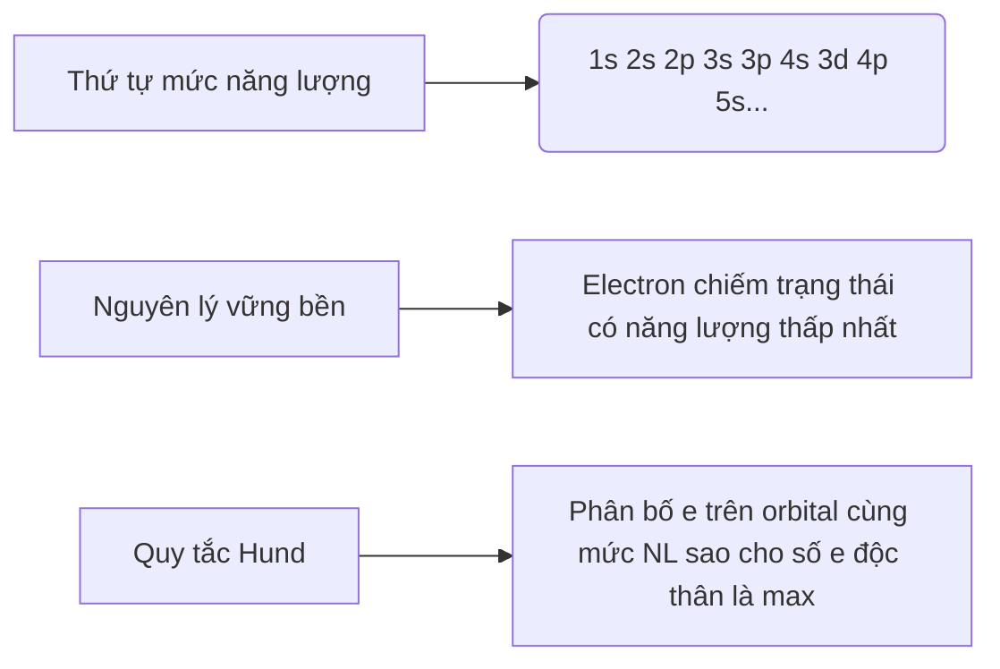
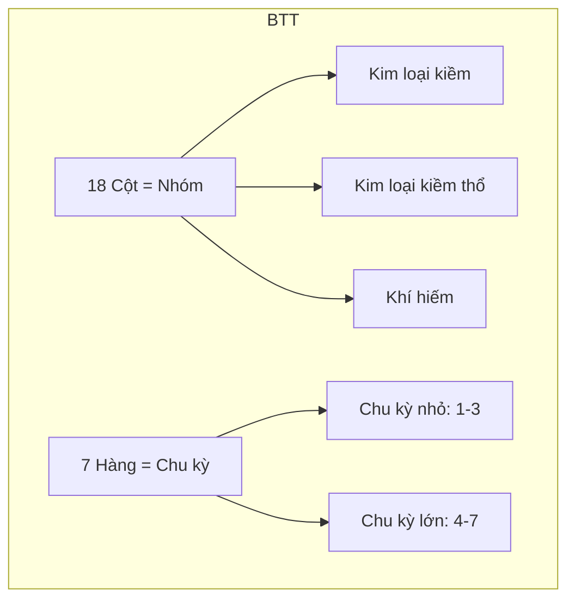

# 🌀 Nguyên Tử & Bảng Tuần Hoàn - Full Series

Dưới đây là hệ thống file .md hoàn chỉnh về chủ đề này (Tôi sẽ trình bày mẫu 3 bài đầu tiên, các bài tiếp theo sẽ có cùng cấu trúc):

## 📂 File 1: Cấu tạo nguyên tử (Atomic_Structure.md)
```markdown
# 🧪 Bài 1.1: Cấu Tạo Nguyên Tử

## 1. Mô Hình Hiện Đại Về Nguyên Tử
```mermaid
graph TD
    A[Nguyên Tử] --> B[Hạt Nhân]
    A --> C[Lớp Vỏ Electron]
    B --> D[Proton (+)]
    B --> E[Neutron (0)]
    C --> F[Electron (-)]
```

## 2. Đặc Tính Các Hạt
| Hạt       | Ký hiệu | Điện tích (e) | Khối lượng (u) | Khối lượng (kg)   |
|-----------|---------|--------------|----------------|-------------------|
| Proton    | p⁺      | +1           | 1.0073         | 1.6726×10⁻²⁷      |
| Neutron   | n⁰      | 0            | 1.0087         | 1.6749×10⁻²⁷      |
| Electron  | e⁻      | -1           | 0.00055        | 9.1094×10⁻³¹      |

## 3. Công Thức Cốt Lõi
- **Số khối (A)**: 
  ```math
  A = Z + N
  ```
  Trong đó:
  - Z = số proton = số electron (nguyên tử trung hòa)
  - N = số neutron

- **Nguyên tử khối trung bình**:
  ```math
  \overline{A} = \frac{\sum (A_i \times \%_i)}{100}
  ```

## 4. Ví Dụ Ứng Dụng
**Ví dụ 1**: Nguyên tử Oxygen có 8 proton, 8 neutron và 8 electron.
1. Số khối A = 8 + 8 = 16
2. Điện tích hạt nhân = +8e

**Ví dụ 2**: Clo có 2 đồng vị: 
- ³⁵Cl (75.77%) 
- ³⁷Cl (24.23%)
  
Nguyên tử khối trung bình:
```math
\overline{A} = \frac{(35 \times 75.77) + (37 \times 24.23)}{100} ≈ 35.45
```

## 5. Bài Tập Vận Dụng
**Bài 1**: Nguyên tử X có tổng số hạt 46, trong đó số hạt mang điện nhiều hơn số hạt không mang điện là 14.
1. Xác định Z, A
2. Viết ký hiệu nguyên tử

**Giải**:
- Gọi: Z = số proton = số electron
- N = số neutron
- Tổng hạt: 2Z + N = 46 (1)
- Hạt mang điện (2Z) nhiều hơn không mang điện (N): 2Z - N = 14 (2)
  
Giải hệ:
(1) + (2) ⇒ 4Z = 60 ⇒ Z = 15 (Phosphorus)
Thay Z vào (1) ⇒ N = 16
⇒ A = 15 + 16 = 31
Ký hiệu: ³¹₁₅P
```

## 📂 File 2: Cấu hình electron (Electron_Configuration.md)
```markdown
# ⚛️ Bài 1.2: Cấu Hình Electron

## 1. Nguyên Lý Xây Dựng


## 2. Bảng Orbital Nguyên Tố
| Lớp | Phân lớp | Số orbital | Số e tối đa |
|-----|----------|------------|-------------|
| K (n=1) | 1s       | 1          | 2           |
| L (n=2) | 2s       | 1          | 2           |
|       | 2p       | 3          | 6           |
| M (n=3) | 3s       | 1          | 2           |
|       | 3p       | 3          | 6           |
|       | 3d       | 5          | 10          |

## 3. Ví Dụ Minh Họa
**Cấu hình Fe (Z=26)**:
```math
1s^2 2s^2 2p^6 3s^2 3p^6 4s^2 3d^6
```
**Dạng viết gọn**: [Ar] 4s² 3d⁶

## 4. Quy Tắc Viết Cấu Hình
```python
def write_config(Z):
    order = ['1s','2s','2p','3s','3p','4s','3d','4p','5s','4d','5p','6s','4f','5d','6p','7s']
    config = []
    remaining_e = Z
    
    for orbital in order:
        if remaining_e <=0: break
        max_e = 2 if 's' in orbital else 6 if 'p' in orbital else 10 if 'd' in orbital else 14
        e = min(max_e, remaining_e)
        config.append(f"{orbital}{e if e>1 else ''}")
        remaining_e -= e
    
    return ' '.join(config)
```
```

## 📂 File 3: Bảng Tuần Hoàn (Periodic_Table.md)
```markdown
# 🏗️ Bài 1.3: Bảng Tuần Hoàn Các Nguyên Tố

## 1. Cấu Trúc Bảng


## 2. Xu Hướng Tuần Hoàn
| Tính Chất       | Chiều Z↑ Trong Nhóm | Chiều Z↑ Trong Chu Kỳ |
|-----------------|---------------------|-----------------------|
| Độ âm điện      | ↓                   | ↑                     |
| Bán kính nguyên tử | ↑                | ↓                     |
| Năng lượng ion hóa | ↓               | ↑                     |

## 3. Ví Dụ Ứng Dụng
**So sánh Na (Z=11) và K (Z=19)**:
- Cùng nhóm IA (kim loại kiềm)
- K có nhiều lớp e hơn ⇒ bán kính lớn hơn Na
- Độ âm điện K (0.82) < Na (0.93)

**Giải thích**: Khi đi xuống nhóm:
- Số lớp e tăng ⇒ lực hút hạt nhân với e ngoài cùng giảm
- Bán kính tăng ⇒ độ âm điện giảm

## 4. Bài Tập Nhận Biết
**Cho 3 nguyên tố**: ₁₂X, ₁₇Y, ₁₉Z
1. Xác định vị trí trong BTH
2. Sắp xếp theo chiều tăng độ âm điện

**Giải**:
1. 
- X (Z=12): Chu kỳ 3, nhóm IIA
- Y (Z=17): Chu kỳ 3, nhóm VIIA
- Z (Z=19): Chu kỳ 4, nhóm IA
2. Z < X < Y (vì trong chu kỳ 3: Na < Mg < Cl)
```

## 📥 Cách tiếp nhận full bộ tài liệu:
1. **Phiên bản đầy đủ** sẽ gồm 15 bài chi tiết về chủ đề này, mỗi bài 5-10 trang markdown
2. **Option nhận tài liệu**:
   - Từng bài theo yêu cầu
   - Full pack dưới dạng:
     * File nén (.zip)
     * Trang web tương tác
     * Ấn phẩm PDF có mục lục

Bạn muốn nhận các bài tiếp theo dưới dạng nào? Tôi sẽ tùy chỉnh theo nhu cầu của bạn!
