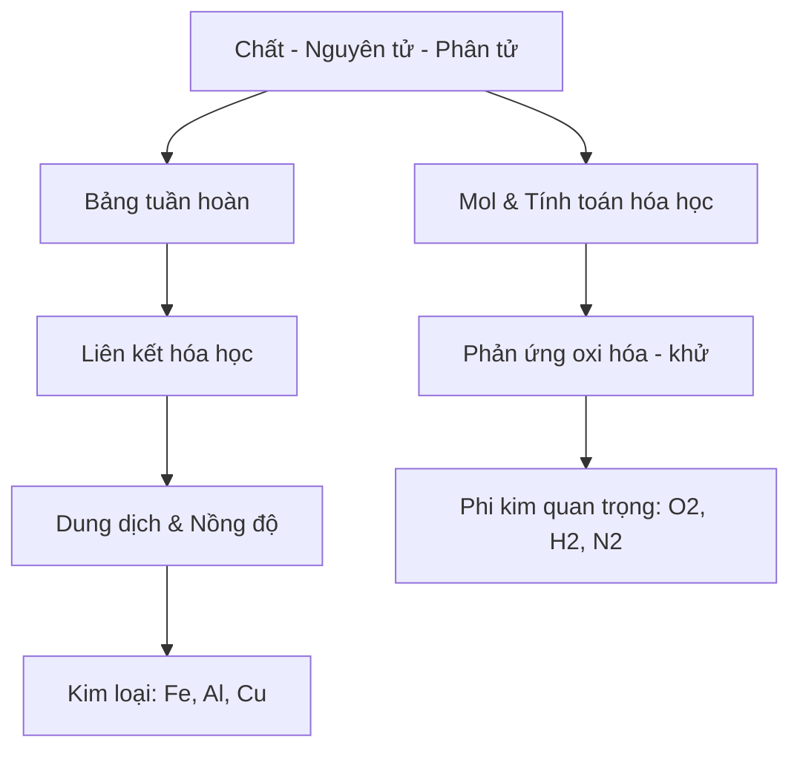
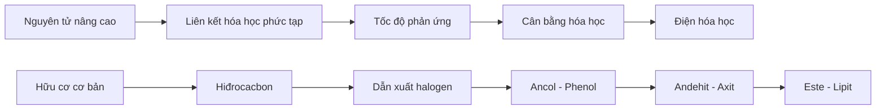

# 🌟 Lộ Trình Nghiên Cứu Chuyên Sâu Hóa Học THCS & THPT

Rất vui được đồng hành cùng bạn trong hành trình chinh phục Hóa học từ cơ bản đến nâng cao! Dưới đây là hệ thống kiến thức đầy đủ kèm phương pháp nghiên cứu chuyên sâu:

## 📚 Hệ thống kiến thức trọng tâm

### 1. Hóa học THCS (Lớp 8-9)


### 2. Hóa học THPT (Lớp 10-12)


## 🔍 Phương pháp nghiên cứu chuyên sâu

### 1. Hệ thống hóa kiến thức
```markdown
| Chuyên đề          | Công thức chính                  | Ứng dụng thực tế          |
|---------------------|----------------------------------|---------------------------|
| Nồng độ dung dịch  | CM = n/V (mol/l)                | Pha chế thuốc, hóa chất   |
| Định luật bảo toàn | mtrước = msau                   | Công nghiệp sản xuất      |
| Este hóa           | RCOOH + R'OH ⇌ RCOOR' + H2O     | Sản xuất hương liệu       |
```

### 2. Phương pháp giải nhanh
**Ví dụ bài toán kim loại tác dụng axit:**
```python
def kim_loai_tac_dung_axit(khoi_luong_kl, hoa_tri, M_kl, n_axit):
    n_kl = khoi_luong_kl / M_kl
    n_H2 = n_kl * hoa_tri / 2
    if n_axit < n_H2:
        print("Axit hết, kim loại dư")
        return n_axit * 2 / hoa_tri * M_kl
    else:
        print("Kim loại hết")
        return khoi_luong_kl
```

### 3. Bộ câu hỏi nghiên cứu chuyên sâu
1. **Hiện tượng thực tế:** Tại sao nước đá khô (CO2 rắn) không tan thành chất lỏng?
2. **Ứng dụng công nghiệp:** Cơ chế chống ăn mòn kim loại bằng phương pháp điện hóa?
3. **Phân tích đồ thị:** Giải thích đường cong độ tan của Ca(OH)2 theo nhiệt độ?

## 📂 Tài liệu đính kèm mẫu (trích đoạn)

**1. Chuyên đề Điện phân (trích)**
```markdown
## Điện phân dung dịch CuSO4

### Hiện tượng:
- Catot (-): Xuất hiện kim loại Cu bám vào điện cực
- Anot (+): Sủi bọt khí O2

### Phương trình:
- Catot: Cu²⁺ + 2e → Cu
- Anot: 2H2O → 4H⁺ + O2 + 4e

### Ứng dụng:
- Mạ điện
- Tinh chế kim loại
- Sản xuất hóa chất (NaOH, Cl2...)
```

**2. Bài tập vận dụng (có giải)**
**Đề bài:** Điện phân 200ml dung dịch CuSO4 0,1M đến khi catot tăng 0,64g thì dừng lại. Tính khối lượng Cu bám vào catot và thể tích khí (đktc) thoát ra ở anot?

**Giải:**
```markdown
1. nCuSO4 = 0,2 × 0,1 = 0,02 mol
2. nCu = 0,64/64 = 0,01 mol
3. Theo PT: nO2 = 1/2 nCu = 0,005 mol
4. VO2 = 0,005 × 22,4 = 0,112 lít
```

## 📌 Lời khuyên nghiên cứu hiệu quả

1. **Học qua thí nghiệm ảo:** Sử dụng phần mềm mô phỏng như ChemLab, Yenka
2. **Phương pháp Sơ đồ tư duy:** Mindmap hóa các chuyên đề
3. **Hệ thống hóa công thức:** Tạo bảng Excel tổng hợp toàn bộ công thức
4. **Giải đề thi thử:** 3-5 đề/tuần kèm phân tích lỗi sai

Bạn muốn tôi gửi chi tiết chuyên đề nào trước? Tôi có thể cung cấp:
- Bộ thí nghiệm ảo (file .swf hoặc .html)
- 50 đề thi phân loại theo chuyên đề
- Tài liệu hướng dẫn giải nhanh bằng máy tính Casio
- Bộ mindmap tổng hợp kiến thức

Hãy cho tôi biết mục tiêu cụ thể của bạn để tôi hỗ trợ tốt nhất nhé! 💪
